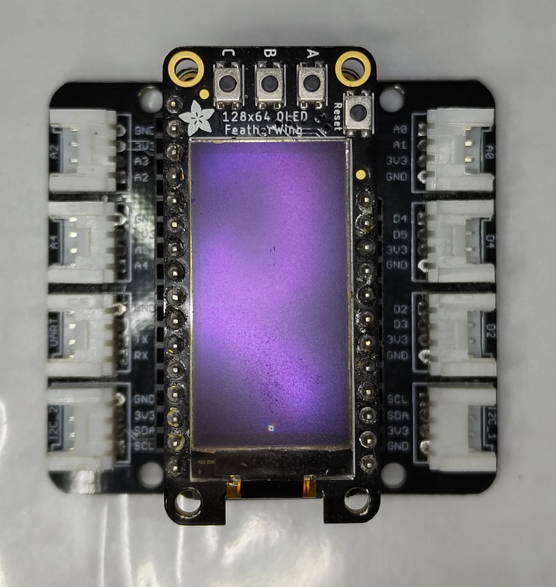
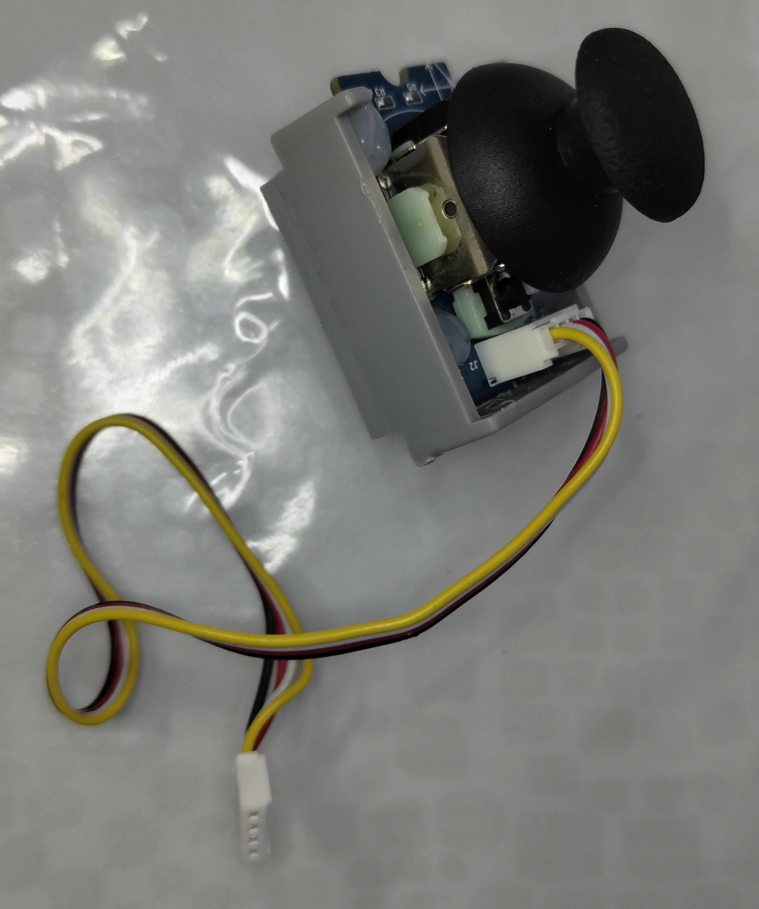
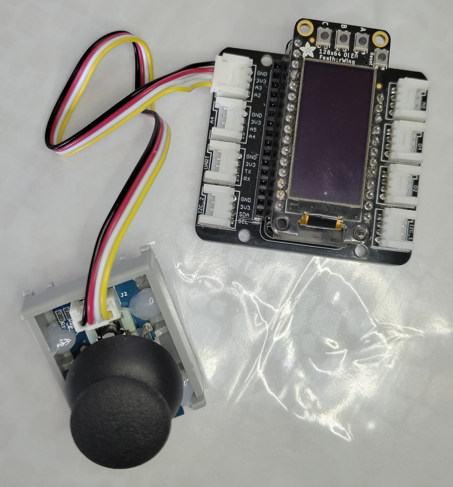

# Projet Scolaire
Ce projet est un projet scolaire effectué dans le cadre d'une SAE à l'IUT Lyon1 de Bourg-en-Bresse.

---

# Présentation du projet

Ce projet est un jeu de **Pong** jouable à deux joueurs sur deux **ESP32** distincts.

Chaque joueur voit uniquement sa partie du jeu sur un écran OLED. Le pad est contrôlable à l'aide un joystick.

Deux modes de jeu sont présents
- Le mode **Duel** : Les deux joueurs s'affrontent en duel. Le Premier arrivé à **10 points** gagne la partie.
- Le mode **Infini** : les deux joueurs coopèrent pour faire durer la partie le plus longtemps possible sans perdre.

# Composants et Installation
## Liste des composants

Les composants **minimum** nécessaires pour jouer au jeu sont :

- Deux ESP32 avec leur GROVE Shield et leur écran OLED :



- Deux joysticks :



## Branchement

Le Joystick doit être branché De la façon suivante à l'ESP32 :

| Broche de l'ESP32 | Broche du joystick |
| ----------------- | ------------------ |
| A2                | X                  |
| A3                | Y                  |
| GND               | GND                |
| 3V3               | VCC                |

Si jamais vous possédez un **GROVE Shield** comme sur l'image précédente, vous pouvez simplement le brancher comme ci-dessous :



## Installation
### Prérequis :

- [L'IDE Arduino](https://www.arduino.cc/en/software/) (ou tout autre IDE qui supporte les ESP32).
- [Les drivers pour le protocole UART](https://www.silabs.com/developers/usb-to-uart-bridge-vcp-drivers).
- Les librairies utilisées par le code Arduino présentes dans le dépôt GitHub.
- Le code des 2 ESP32 (`player_1` et `player_2`) également présents dans le dépôt GitHub.

### Étapes d'installation :
1. Ouvrez l'IDE Arduino, allez dans **Board Manager** puis tapez `ESP32`, installez le premier résultat.
2. Récupérez les adresses MAC des deux ESP32. Pour cela, téléversez le code suivant dans chaque cartes, puis ouvrez le **moniteur série**.
```cpp
#include <WiFi.h>

void setup() {
  Serial.begin(115200);

  WiFi.mode(WIFI_STA);
  delay(100);

  if (WiFi.getMode() != WIFI_STA) {
    Serial.println("Erreur : ESP32 n'est pas en mode station !");
    return;
  }

  String mac = WiFi.macAddress();
  Serial.print("Adresse MAC de l'ESP32 : ");
  Serial.println(mac);
}

void loop() {}
```
3. Notez les adresses MAC obtenues.
4. Téléchargez toutes les **bibliothèques** nécessaires, ou copiez celles du dépôt dans votre dossier de librairies Arduino modifiable dans paramètres de l'IDE.
5. Ouvrez les programmes `player_1` et `player_2`.
6. Dans le fichier `player_1.ino`, renseignez **l'adresse MAC du second ESP32**, et dans le fichier `player_2.ino`, celle du premier ESP32 sur cette ligne :
```cpp
uint8_t peersMAC[] = {0x94, 0xB9, 0x7E, 0x6B, 0x12, 0xE0};
```
*(Ceci correspond à l'adresse MAC `94:B9:7E:6B:12:E0`)*

7. Sauvegardez, puis téléversez les deux programmes `player_1` et `player_2` dans chaque ESP32 respectif.

Le jeu est maintenant prêt à fonctionner !
# Fonctionnement du jeu

1. Appuyez simultanément sur le bouton **Reset** des deux ESP32 pour les **synchroniser / connecter**.
2. Sur l'ESP32 `player_1`, utilisez :
	- Le bouton A pour lancer une partie en mode **Versus**
	- Le bouton B pour lancer une partie en mode **Infini**.
3. Utilisez le joystick pour contrôler le pad et faites rebondir la balle pour marquer des points ou tenir le plus longtemps possible !

# Licence et crédits

Ce projet à été réalisé par **Dechaumet Anthony** et **Cléïa Barrallon** dans le cadre de la **SAÉ 203** à **l'IUT Lyon 1 - département de Bourg en Bresse**.

Ce projet est sous la **MIT Licence**.
